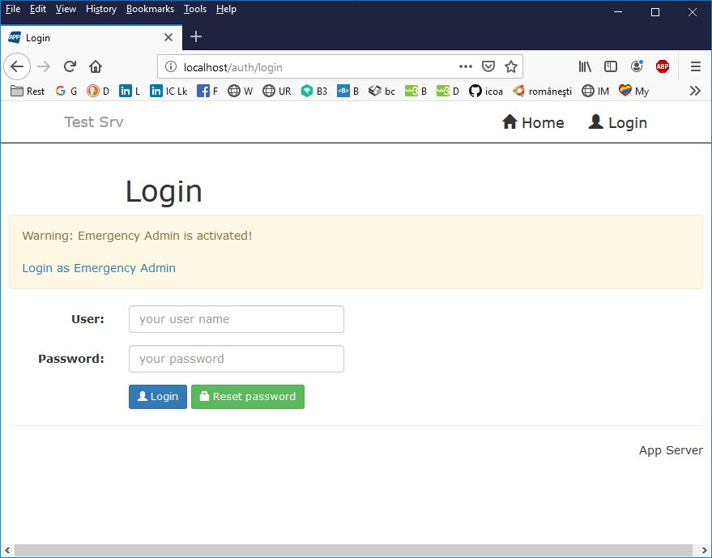

# Web App Server

## Activate emergency admin and start server

Before to start the web server you need to activate 
the **Emergency Admin**.

To do so, just uncomment the line **emergency admin = yes** from server **config.ini**.

Then start the server using one of the scripts:

```bash
while true
do
        python main.py
        if [ ! 0 -eq $? ]
        then
            echo "Server error."
            echo -n "Press ENTER to retry."
            read
        fi
        sleep 1
done
```

or, in **Windows**,

```bat
@echo off
:SET PY=c:\python27\python
SET PY=c:\python37\python
:loop
	if exist main.py %PY% main.py
	if exist main.exe main.exe
	if not "0" == "%ERRORLEVEL%" pause
goto loop
```

Login to web server using the **emergency admin** link:



